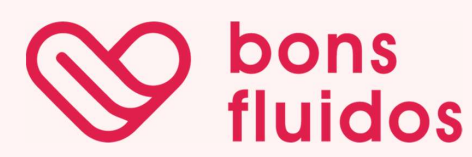

# Bons Fluídos
 
 

AS63C - N13 - Desenvolvimento Ágil - 2025.1 
EC45G - C51 - Certificadora da Competência - 2025.1 

<h1>INTEGRANTES:</h1>
<ul>
  <li><a href="https://github.com/Midvirus">Gabriel de Almeida Soares Janscoki</a></li>
  <li><a href="https://github.com/JoseRenatoCardoso">José Renato Cardoso de Campos</a></li>
  <li><a href="https://github.com/LaraEnglerth">Lara Englerth de Camargo</a></li>
  <li><a href="https://github.com/NanatUtida">Nathaniel Pereira Utida</a></li>
  <li><a href="https://github.com/SoulStorm0">William Eidi Yamaguchi</a></li>
</ul>

Sistema Web de controle de produtos, doações e estoque do projeto Bons Fluídos. 

<h2>SITE:<h2>

<a href="https://joserenatocardoso.github.io/AGILE-2025.1/src/PAGINAS/gerenciamento_estoque/gern.html">Gerenciamento</a>

